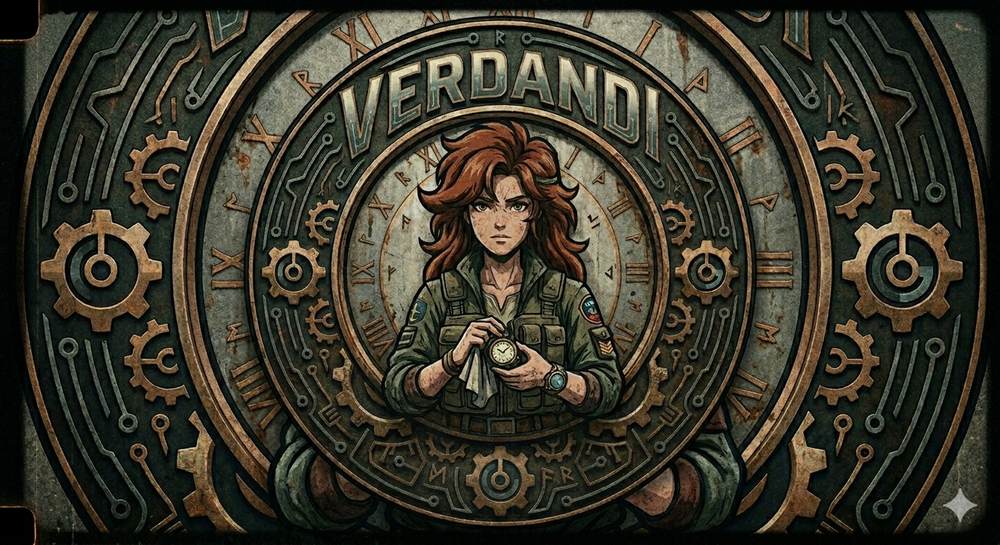

<div align="center">
    <br>
    <div>
        
    </div>
    <br>
    <br>
</div>

> Watch the present; control your life.

Verdandi runs a countdown in your terminal and plays a sound when time's up — then loops a celebratory braille-rendered GIF until you press a key. Bring your own audio. Bring your own GIF (soon).

## Demo

<video src="assets/demo/final-capture-verdandi.mp4" controls width="600"></video>

## Features

- Plain-text terminal UI — runs anywhere a terminal does
- Flexible duration parsing (`25m`, `1h`, `90 sec`, `10`)
- Embedded default chime and GIF so it works out of the box
- Custom chime via `--audio_file_path` (mp3, wav, flac, etc. — anything [miniaudio](https://miniaud.io) supports)
- Braille-rendered animated GIF with adaptive dithering on completion
- Alt-screen + raw-mode terminal handling that cleans up on exit

## Installation

### Linux

```sh
curl -LO https://github.com/yourusername/verdandi/releases/latest/download/verdandi-linux-amd64
chmod +x verdandi-linux-amd64
./verdandi-linux-amd64
```

### macOS

Because Verdandi is not signed with an Apple Developer certificate, macOS will block it by default. After downloading, run:

```sh
curl -LO https://github.com/yourusername/verdandi/releases/latest/download/verdandi-darwin-arm64
xattr -d com.apple.quarantine verdandi-darwin-arm64
chmod +x verdandi-darwin-arm64
./verdandi-darwin-arm64
```

### Windows

Currently not supported.  Will work on this in the future (see TODOs).

## Usage

```sh
# 25-minute work block
verdandi 25m

# split form — amount and unit as separate args
verdandi 90 sec

# half hour
verdandi 0.5h

# ten minutes
verdandi 10
```

Press `q` (or `Ctrl-C`) at any time to quit.

### Supported time units

| Unit     | Aliases                       |
| -------- | ----------------------------- |
| Seconds  | `s`, `sec`, `second`, `seconds` |
| Minutes  | `m`, `min`, `minute`, `minutes` |
| Hours    | `h`, `hr`, `hrs`, `hour`, `hours` |

## Custom chime

Set a custom audio file and verdandi will copy it into its config directory and use it for every subsequent run:

```sh
verdandi --audio_file_path=./my-bell.mp3
```

The file is stored at:

- **macOS / Linux** — `$HOME/.config/verdandi/`
- **Windows** — `%APPDATA%\verdandi\`

To revert to the default chime, delete `custom-audio-file.*` from the config directory.

## How it works

Verdandi is a small Odin program wired to three things:

- **[`miniaudio`](https://miniaud.io)** — the Odin vendor binding handles cross-platform audio playback for the chime.
- **[`gifdec`](https://github.com/lecram/gifdec)** — a tiny C GIF decoder, statically linked via Odin's `foreign import`, used to decode the celebratory GIF frame-by-frame.
- **[`stb_image_resize2`](https://github.com/nothings/stb)** — also statically linked, used to scale frames to the current terminal size before they get dithered into braille glyphs.

On timer completion, frames are downsampled, run through Otsu thresholding + Floyd–Steinberg dithering, and mapped to 2×4 dot braille cells so animation works in any terminal that can render Unicode.

## Building from source

Verdandi has two C dependencies that are statically linked. Prebuilt artifacts for macOS, Linux, and Windows are included under `vendor/`.

### Rebuilding the C libraries

If you need to rebuild them, the easiest path on macOS / Linux is [zig](https://ziglang.org) (acts as a cross-compiler with no extra setup):

```sh
# Linux / macOS native
clang -O2 -c vendor/gifdec/gifdec.c -o vendor/gifdec/gifdec.o
ar rcs vendor/gifdec/libgifdec.a vendor/gifdec/gifdec.o

clang -O2 -c vendor/stb_image_resize2/stb_resize_impl.c -o vendor/stb_image_resize2/stb_resize_impl.o
ar rcs vendor/stb_image_resize2/libstb_resize.a vendor/stb_image_resize2/stb_resize_impl.o

# Windows (cross-compiled with zig)
zig build-lib -target x86_64-windows-gnu -lc -O ReleaseFast \
    vendor/gifdec/gifdec.c \
    -femit-bin=vendor/gifdec/gifdec.lib

zig build-lib -target x86_64-windows-gnu -lc -O ReleaseFast \
    vendor/stb_image_resize2/stb_resize_impl.c \
    -femit-bin=vendor/stb_image_resize2/libstb_resize.lib
```

The Odin packages in `gifdec/` and `stb_resize/` pick the right artifact based on `ODIN_OS`.

## Project layout

```
.
├── main.odin                  # entry point, CLI parsing, main loop
├── gif.odin                   # GIF → grayscale → braille pipeline
├── digits.odin                # block-character digits for the clock
├── terminal_posix.odin        # raw mode + terminal size (Linux/macOS)
├── terminal_windows.odin      # raw mode + terminal size (Windows)
├── gifdec/                    # Odin bindings for the gifdec C library
├── stb_resize/                # Odin bindings for stb_image_resize2
├── vendor/                    # bundled C sources + prebuilt static libs
└── assets/                    # default GIF + default chime + logos
```

## Contributing

Bug reports and pull requests welcome. Before opening a PR:

1. Run `odin build .` and confirm a clean build on at least one platform.
2. Test the golden path — `verdandi 3s` — and confirm the chime plays and the GIF renders.
3. If you touched the C bindings, rebuild the static libs and include them.

Roadmap is tracked in [`TODOS.org`](TODOS.org).

## What does `verdandi` mean?

In Norse mythology, **Verðandi** is one of the three Norns — the embodiment of *the present*. Fitting for a tool that helps you stay in it.

## Credits

The default sound effect and animation bundled with Verdandi are property of **Capcom**. All rights reserved by Capcom. These assets are not covered by this project's license.

## License

See [`LICENSE`](LICENSE).
